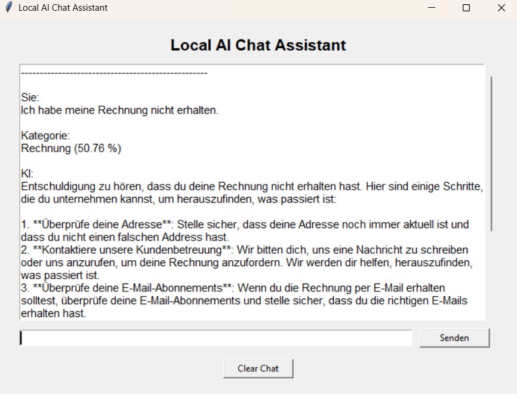
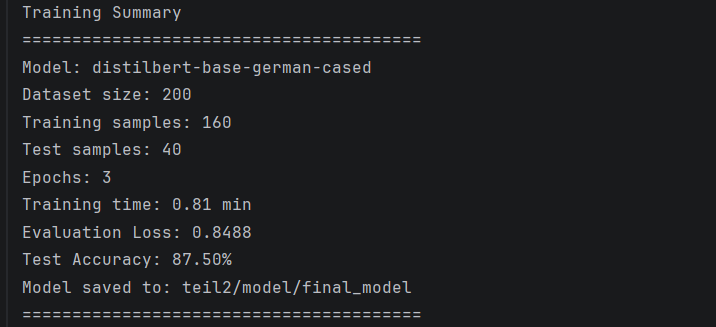

# Local AI Assistant

A local desktop AI assistant for German customer-service messages.

The application combines three components:

1. a local language model running through **Ollama**;
2. a fine-tuned **German DistilBERT** classifier;
3. a simple local **retrieval** component using TF-IDF and cosine similarity.

The final Tkinter interface displays the user's message, its predicted category and confidence score, and an
AI-generated answer based on the local knowledge base.

## Features

- Runs locally without a cloud LLM API
- Desktop GUI built with Tkinter
- German customer-message classification
- Four categories: `Anfrage`, `Reklamation`, `Rechnung`, `Sonstiges`
- Confidence score based on the highest Softmax probability
- Local knowledge base stored as text files
- TF-IDF retrieval with cosine similarity
- Context-grounded answers generated by Llama 3.2
- Standalone scripts for training, prediction, dataset inspection, and retrieval testing

## Architecture

```text
User message
    │
    ├──► DistilBERT classifier
    │       └──► category + confidence
    │
    └──► TF-IDF retrieval
            └──► most relevant local document
                    └──► Ollama / Llama 3.2
                            └──► grounded answer

All results are displayed in the Tkinter GUI.
```

## Project Structure

```text
Local-AI-Assistant/
│
├── teil1/
│   ├── knowledge/
│   │   ├── garantie.txt
│   │   ├── kontakt.txt
│   │   ├── lieferung.txt
│   │   ├── rechnung.txt
│   │   └── reklamation.txt
│   ├── chat.py
│   ├── gui.py
│   ├── main.py
│   └── retrieval.py
│
├── teil2/
│   ├── data/
│   │   └── dataset_teil2.csv
│   ├── model/
│   │   └── final_model/          # generated after training
│   ├── check_dataset.py
│   ├── classifier.py
│   ├── predict.py
│   └── train.py
│
├── images/
│   ├── teil1_chat.png
│   ├── retrieval_example.png
│   └── training_model_teil2.png
│
├── .gitignore
├── README.md
└── requirements.txt
```

## Part 1: Local AI Chat Assistant

### Goal

Build a desktop assistant that communicates with a locally running language model and answers customer-service questions
using local documents.

### Technologies

- Python
- Tkinter
- Ollama
- Llama 3.2:3b
- Scikit-learn

### Retrieval Bonus

Before a question is sent to the language model, the application searches the local knowledge base.

The retrieval pipeline is:

```text
knowledge documents
    └──► TF-IDF document vectors

user question
    └──► TF-IDF question vector
            └──► cosine similarity
                    └──► best matching document
                            └──► context for the LLM
```

A minimum similarity threshold is used. If no sufficiently relevant document is found, the application returns a fixed
message instead of asking the model to invent an answer.

The implementation is intentionally simple and designed for demonstration purposes. TF-IDF compares lexical similarity
and does not provide the same semantic understanding as embedding-based retrieval.

## Part 2: German Text Classification

### Goal

Fine-tune a transformer model to classify German customer messages.

### Categories

- `Anfrage`
- `Reklamation`
- `Rechnung`
- `Sonstiges`

### Dataset

The dataset was created manually and contains:

- 200 German text examples
- 4 balanced categories
- 50 examples per category
- no missing values
- no duplicate rows

### Training Pipeline

1. Load and validate the CSV dataset.
2. Convert category names to numerical IDs.
3. Create a stratified train/test split.
4. Convert the data to Hugging Face Dataset objects.
5. Tokenize the texts.
6. Fine-tune `distilbert-base-german-cased`.
7. Evaluate the model on the test set.
8. Save the model and tokenizer locally.

### Training Results

| Parameter        |                          Value |
|------------------|-------------------------------:|
| Base model       | `distilbert-base-german-cased` |
| Dataset size     |                            200 |
| Classes          |                              4 |
| Training samples |                            160 |
| Test samples     |                             40 |
| Epochs           |                              3 |
| Batch size       |                              8 |
| Learning rate    |                         `2e-5` |
| Training time    |         approximately 0.82 min |
| Evaluation loss  |                         0.8794 |
| Test accuracy    |                     **87.50%** |

Results may vary slightly between systems and training runs.

## Example

### Input

```text
Wie bekomme ich eine Rechnung?
```

### Output

```text
Kategorie:
Anfrage (67.46 %)

KI:
Die Rechnung wird nach Abschluss der Bestellung automatisch per E-Mail
verschickt. Falls sie nicht im Posteingang zu finden ist, sollte auch der
Spam-Ordner geprüft werden.
```

The classifier category and the retrieval document are independent components. The classifier predicts the general
message type, while retrieval selects the document used as context for the answer.

## Requirements

- Python 3.10 or newer
- Ollama installed locally
- Git
- Internet access during initial dependency, model, and tokenizer downloads

Tkinter is included with most standard Python installations.

## Installation

### 1. Clone the repository

```bash
git clone https://github.com/FootballOnlooker/Local-AI-Assistant.git
cd Local-AI-Assistant
```

### 2. Create a virtual environment

```bash
python -m venv .venv
```

Activate it on Windows:

```bash
.venv\Scripts\activate
```

Activate it on Linux or macOS:

```bash
source .venv/bin/activate
```

### 3. Install dependencies

```bash
pip install -r requirements.txt
```

### 4. Download the Ollama model

```bash
ollama pull llama3.2:3b
```

Ensure that Ollama is running. Depending on the installation, it may start automatically. Otherwise run:

```bash
ollama serve
```

### 5. Train the classifier

The trained model is not stored in Git because model files are large.

```bash
python teil2/train.py
```

This creates:

```text
teil2/model/final_model/
```

### 6. Run the application

```bash
python -m teil1.main
```

## Additional Commands

Inspect the dataset:

```bash
python teil2/check_dataset.py
```

Run standalone classification:

```bash
python teil2/predict.py
```

Test retrieval in the terminal:

```bash
python teil1/retrieval.py
```

## Suggested Test Questions

Relevant questions:

```text
Wie lange gilt die Garantie?
Wie bekomme ich eine Rechnung?
Wie lange dauert die Lieferung?
Wie kann ich den Kundenservice kontaktieren?
Wie melde ich eine Reklamation?
```

Out-of-domain question:

```text
Wie wird das Wetter morgen?
```

For an out-of-domain question, the application should state that the information is not contained in the provided
documents.

## Screenshots

### Local AI Assistant



### DistilBERT Training



## Limitations

- The classifier is trained on a small manually created dataset.
- Accuracy on new or ambiguous messages may be lower than the reported test accuracy.
- The confidence score is the highest Softmax probability and is not a guarantee that the prediction is correct.
- TF-IDF retrieval relies mainly on shared words and may select an imperfect document for unusual formulations.
- Ollama and the trained classifier must be available locally before the GUI can run.
- The GUI currently performs model calls synchronously, so it may briefly appear unresponsive while the local LLM
  generates an answer.

## Possible Improvements

- Replace TF-IDF retrieval with multilingual sentence embeddings.
- Cache TF-IDF document vectors instead of rebuilding them for every query.
- Expand and diversify the classification dataset.
- Add F1 score, a classification report, and a confusion matrix.
- Run model calls in a background thread to keep the GUI responsive.
- Add automated tests for retrieval and classification.

## Purpose

This project was created as an educational and technical demonstration of:

- local LLM integration;
- transformer fine-tuning;
- text classification;
- retrieval-augmented generation;
- desktop GUI development;
- integration of multiple AI components in one Python application.
